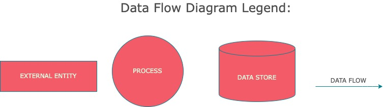
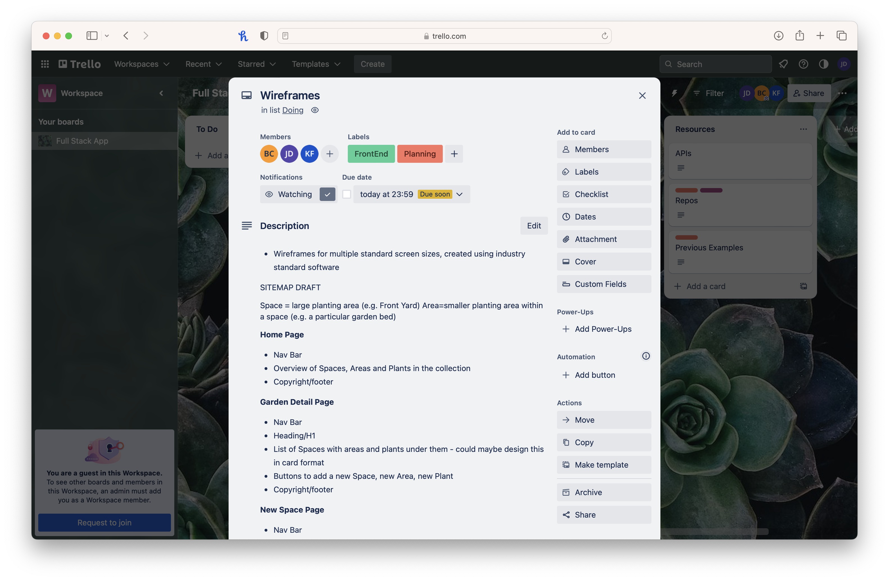
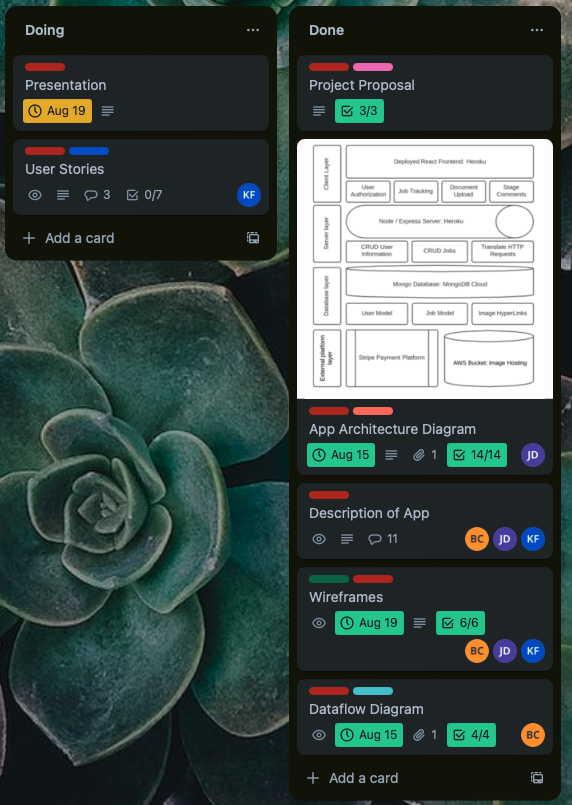

# T3A2-A - Full Stack App (Part A)

## Garden Tracker App - *Plantscape*
### Joshua Davis, Kal Fung, Benjamin Campbell

#### **README Contents:**
1. [Project Purpose](#Project-Purpose)  
1. [Functionality and Features](#Functionality-and-Features)  
1. [Target Audience](#Target-Audience)  
1. [Tech Stack](#Tech-Stack)  
1. [Data Flow Diagrams](#Data-Flow-Diagrams)
1. [Application Architecture Diagrams](#Application-Architecture-Diagrams)  
1. [User Stories](#User-Stories)  
1. [Wireframes](#Wireframes) 
   - [Site Flow](#Site-Flow)
   - [Mobile](#Mobile)
   - [Tablet](#Tablet)
   - [Desktop](#Desktop)  

1. [Project Management](#Project-Management)

#### **Project Links:**
[_• GitHub Repository_](https://github.com/bccbass/T3A2-A)  
[_• Trello Project Board_](https://trello.com/b/gYwjxwsb/full-stack-app)

### Purpose
So you’ve just spent a weekend and a small fortune to landscape your front yard and now you can’t remember the names of any of your new plants, let alone their care needs and schedules. Sure you could save the small plastic information tags for every plant in a ziplock bag, toss it in a drawer in your garage and hope to find it before your new babies have withered away… Or you could start using ***Plantscape***!  

The intended purpose of the Plantscape app is to create an organized collection of landscaped areas or plants so a user may access information, care instructions and schedules in one central location. It is intended as both a means to concentrate relevant information as well as to log and schedule care events such as watering, feeding and fertilizing. Regardless of whether the user is an individual garden owner or a landscape professional its intent is to promote a meaningful connection to a users landscape, empowering them to become actively involved with the success of the flora that surrounds them.

 

### Functionality and Features
- Users can navigate to pages for individual plants in any area of their property
- Users can view watering, feeding and mulching schedules for any given plant
- Users can view all their plants filtered by e.g. edible/ornamental, due for watering/feeding
- Users can edit or create new areas

 

### Target Audience
Plantscape is primarily targeted towards individuals wishing to establish and maintain a new garden, or to catalogue and maintain an already established garden. These individuals live in rural, semi-rural or even metropolitan areas and the responsibility for garden maintenance could be shared between multiple individuals. With this in mind, the target audience groups are best summarised as:
- An aspiring gardener/s wanting to establish a new garden
- An existing gardener/s wanting to document and catalogue the plants in their current garden
- A home or apartment owner/s in a metropolitan setting wanting to keep a record of the plants in their home and details of their upkeep  

Additionally, we are also targeting our application towards the owners of small landscaping businesses. They can use the application’s functionality to create a new client and input garden information as part of their service package.
The common attribute of individual 1, 2 and 3, as well as the small business owner, is that they all want an efficient, user-friendly and helpful application to document not only their plants, but also details on the plants’ upkeep and maintenance.
Note: While our application is geared towards the hobbyist or casual gardener, the scope of the application can still meet the needs of even the more seasoned gardener. The data model we have chosen is flexible and individual enough to allow users to input as many planting areas in as many planting spaces as needed.

 

### Tech Stack
We used the MERN stack as a web development framework for our application. This consists of:
- MongoDB — a document-oriented, NoSQL database program which uses - JSON-like documents with optional schemas
- Express — a Node web application framework primarily used for routing and middleware
- React — a JavaScript library, maintained by Meta, for developing the user interfaces and front end components of our application
- Node — allows developers to create server-side tools and applications, but we used it with Express as a web framework to enhance its functionality  

In addition to these core technologies, we also used:
- Mongoose — provides functionality for MongoDB object modelling and validation
- Render — deployment platform for our back end
- Netlify - deployment platform for our front end
- Vitest and testing-library — front end unit testing
- Supertest — back end, API unit testing
- HTML
- CSS

 

### Data Flow Diagrams

The primary ways data flows within the application are:
- standard user registration/login actions
- full crud for a collection spaces (larger areas of a property ie. front yard, back yard) 
- full crud operations for areas (sub-sections of a space ie. northwest flower bed, verge).

Both spaces and areas allow for user provided names, descriptions and notes which are stored in the users collection on the database. The app also allows for user uploaded images of spaces and areas. Images are uploaded to an AWS image server, which then responds with an image URL. The returned image URL is then stored appropriately in the users collection on the database. 

 

#### Legend  

  

 

#### Overview  

  

 

#### Login  

  

   

#### View Spaces and Areas  

  

   

#### Create and Update Spaces and Areas  

  

   

#### Image Upload

  

 
 

### Application Architecture Diagram

#### Overview

 

#### Legend

 

### User Stories
A user story is an informal and general explanation of a software feature written from the perspective of the end user. Its purpose is to articulate how a software feature will provide value to the customer. These are an important, and ongoing, part of any agile development and we implemented them into our Trello board as a part of our initial planning and brainstorming process; however, we found merit in revisiting them throughout the planning process, modifying existing user stories, and adding new user stories to reflect additional functionality we wanted to include. We found it helpful being able to consider what the specific user might require functionally from the application and we made sure to incorporate their needs into the design of the application.

The first iteration of our user stories consisted of the following:

*User stories progress, August 18*
- As a user, I'd like to be able to view the status of a plant, and its watering and fertilising schedule (GET one)
- As a user, I'd like to be able to change what is planted in a plot (PUT/PATCH)
- As a user, I'd like to be able to remove what is planted in a plot (DELETE)
- As a user, I'd like to be able to view a summary of all my spaces, areas and plants (GET all)
- As a user, I'd like to input a new planting area to be tracked (POST?)
- As a user, I'd like to be able to update the watering or fertilising schedule for a single plant (PUT/PATCH)
- As a user, I'd like to input the details of a new plant (POST)

As shown through the verbs specified after each entry, these user stories were beneficial in unpacking what functionality our application should include. For example, we decided that retrieving user data about a plant and editing and deleting that same data was going to be important.

However, we added further detail to the format of each story by adding more specificity about each user as a persona. The target audience for our application, as outlined above, is broad and the appeal of it as a garden planning and upkeep tool will only be improved if we are able to accommodate these wide variety of personas. With this in mind, we added the following user stories:

*User stories progress, August 19*
- As an avid gardener, I want to be able to log detailed records of my plants, so I can remember how to properly care for each one.
- As an experienced gardener, I want each plant log to contain detailed care instructions, so I can use the application to increase my knowledge of plants.
- As a homeowner, I want to be able to add details of plants as I research them, so I can plan out my garden thoughtfully.
- As a city dweller, I still want to be able to log details about the plants in my apartment, so I can properly care for each one.
- As a hesitant gardener, I want to be able to check the details of just my indoor plants, so I don't kill them!

The development of these user stories greatly helped in defining our target audience, as well as highlighting functionality opportunities.

We were able to further use this user story structure of 'persona, what and why' to document the following additional user stories:  

*User stories progress, August 20*  

- As a Landscape business owner I would like to create a profile for my clients upon project completion so they have a record of their new landscaping with notes and care instructions. 
- As a homeowner who recently invested in a large scale landscaping project, I would like to know what was planted in each area of my property and create a care schedule to protect my investment.  
- As a new gardener, I would like to create a collection of plants I'm considering adding to my garden so I can organize and compare my selections before I make a final purchase.   

 

### Wireframes
Wireframing was implemented using Figma. Members submitted design proposals for a Mobile homepage and design elements were combined to create a general style guide for the app. Members used the resulting base style guide to build out wireframes for all app views and sizes.

The overall site flow and navigation is visually depicted below using arrows. At its core, our application's home page contains a snapshot of the User's Spaces, Areas and Plants. At mobile width, there is also a hamburger menu containing links to 'My Garden' and 'My Plants.' On the home page, users can select to 'Add Space' and this will directly take them to the form to do so. Additionally, a user can click on any one of their Spaces or Areas and be taken to the 'My Garden' page, which acts as a more in-depth summary of a specific Space in their garden or home. If a user selects a particular plant on the home page, they will be taken to the plants record in 'My Plants.'

In the View Space/My Garden view, users have the ability to navigate around the application to perform such tasks as:
- Editing a Space
- Adding a new Area to a Space
- Editing an existing Area
- Adding a Plant
- Adding notes

#### *Site Flow*

#### *Mobile*

#### *Tablet*

#### *Desktop*

### Project Management

[_• Trello Project Board_](https://trello.com/b/gYwjxwsb/full-stack-app)

The project is managed using Agile methodologies aided by a shared Trello project board. Task cards are created, assigned and given a due date in order to keep progress on track and reduce any disruption of creation flow. Additionally, communication on a group Discord and casual individual daily standups are used to keep perspective and adapt to the needs of the project. Members take turns participating in a more formal group daily standup on the cohort's Discord channel. For source control the team is using GitHub and implementing a Feature Branch git workflow.

###### Progress: August 18, 2023

 

 

 

   

###### Progress: August 19, 2023

###### Progress: August 20, 2023

